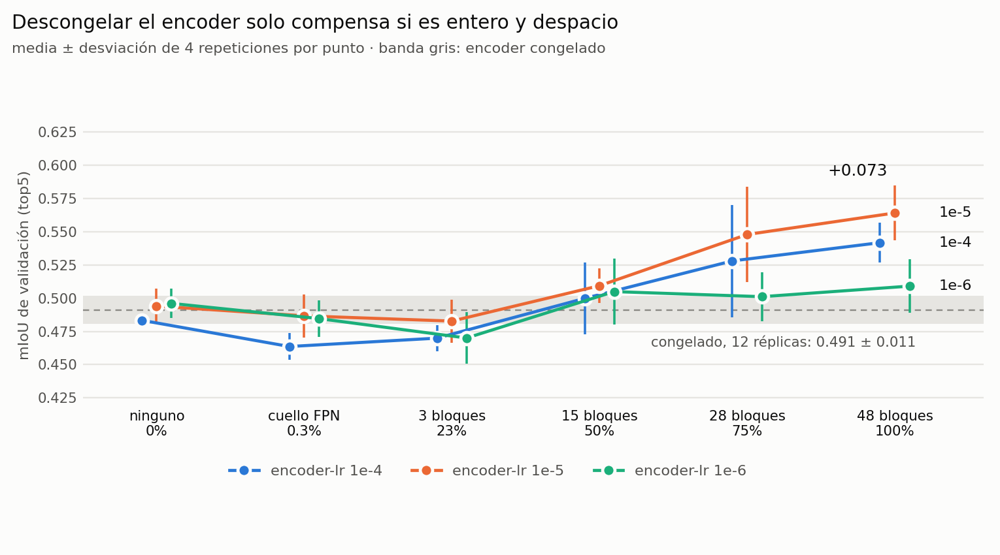

# Segmentación semántica de SuperTuxKart con SAM 2

Transfer learning desde **Segment Anything Model 2** para clasificar cada píxel de un
frame del videojuego en una de 7 clases: `background`, `track`, `kart`, `pickup`,
`nitro`, `bomb`, `projectile`.

*Proyecto Final · Visión Artificial 202610 · Universidad San Francisco de Quito*

**mIoU 0.6008** sobre dos circuitos nunca vistos, frente a 0.4629 de una U-Net entrenada
desde cero con el mismo dataset y el mismo split.

<picture>
  <source media="(prefers-color-scheme: dark)" srcset="docs/figuras/cualitativo-dark.png">
  
</picture>

Ninguno de estos circuitos se usó para entrenar.

---

## Por qué SAM 2 no sirve tal cual

SAM 2 **no es un segmentador semántico**. Es *promptable* y *binario*: recibe una imagen
más un prompt —un punto, una caja— y devuelve la máscara del objeto señalado. No sabe qué
es un kart ni distingue siete clases.

Lo que sí tiene es un **image encoder** entrenado sobre millones de máscaras. El transfer
learning consiste en:

1. Reutilizar ese encoder, con sus pesos preentrenados, como extractor de features.
2. Descartar la *memory attention* (es para vídeo) y el *mask decoder* original (es binario).
3. Añadir una **cabeza nueva** que fusiona los tres niveles del FPN y produce 7 logits por píxel.
4. **Afinar el encoder entero** con un learning rate cien veces menor que el de la cabeza,
   para adaptarlo al aspecto de un videojuego sin destruir lo que ya sabe.

## Arquitectura

- **Encoder**: SAM 2.1 Hiera-Large, pesos preentrenados, afinado entero con `lr` 1e-5
  (212.7 M parámetros).
- **Features**: `backbone_fpn`, 3 niveles de 256 canales a strides 4, 8 y 16.
- **Cabeza**: FPN de grueso a fino, nueva, con `lr` 1e-3 (2.56 M parámetros), terminada en
  una convolución 1×1 a 7 logits por píxel, sin softmax.
- **Entrada y salida**: el `forward` normaliza, reescala a 448×448 y devuelve los logits al
  tamaño original de la imagen, así que acepta cualquier resolución.

---

## Probarlo

### Sin instalar nada — Colab

[](https://colab.research.google.com/github/ferjozsot23/sam2-transfer-learning/blob/main/demo.ipynb)

Abre el notebook, *Ejecutar todas*, y sube tus imágenes cuando lo pida. Descarga el modelo
la primera vez y devuelve las máscaras en un zip.

### En local

```bash
pip install -r requirements.txt
python predict.py ejemplos/
python predict.py mis_imagenes/ --out salida/ --masks
```

Cada imagen produce un panel `original | segmentación | superposición`. Con `--masks`
guarda además la máscara cruda de 1 canal con valores 0–6.

### Desde tu propio código

```python
from models import load_model

model = load_model('model.th')
pred  = model(x).argmax(1)
```

`x` es un tensor `(B,3,H,W)` en `[0,1]` y la salida `(B,H,W)` con el índice de clase de
cada píxel.

**`model.th` pesa 861 MB** y está en la sección *Releases*, porque GitHub no admite ficheros
de más de 100 MB; `predict.py` y el notebook lo descargan solos. Incluye el encoder afinado
completo, así que no hace falta descargar además el checkpoint preentrenado de SAM 2: carga
sin conexión.

---

## Resultados

<picture>
  <source media="(prefers-color-scheme: dark)" srcset="docs/figuras/iou-dark.png">
  
</picture>

| clase | IoU |
|---|---|
| background | 0.8791 |
| track | 0.8743 |
| kart | 0.8158 |
| pickup | 0.5496 |
| nitro | 0.4562 |
| bomb | 0.2180 |
| projectile | 0.4124 |
| **mIoU** | **0.6008** |

Medido con una matriz de confusión acumulada sobre los 500 frames de validación, nunca
promediando IoU por lote.

**El split es por circuito, no por frame.** Los frames de un mismo circuito son casi
idénticos —el kart avanza unos centímetros por frame— así que un split aleatorio pondría
frames gemelos a ambos lados y daría un mIoU alto y falso.

| | circuitos | frames |
|---|---|---|
| entrenamiento | `abyss`, `gran_paradiso_island`, `hacienda`, `olivermath` | 1000 |
| validación | `lighthouse`, `volcano_island` | 500 |

### Contra una U-Net entrenada desde cero

El mismo dataset y el mismo split se resolvieron antes sin transfer learning:

| clase | U-Net | SAM 2 | |
|---|---|---|---|
| background | 0.7768 | **0.8791** | +0.102 |
| track | 0.7365 | **0.8743** | +0.138 |
| kart | 0.6709 | **0.8158** | +0.145 |
| pickup | 0.5013 | **0.5496** | +0.048 |
| bomb | 0.0194 | **0.2180** | +0.199 |
| projectile | 0.0000 | **0.4124** | +0.412 |
| nitro | **0.5352** | 0.4562 | −0.079 |
| **mIoU** | 0.4629 | **0.6008** | **+0.138** |

Gana en 6 de las 7 clases. El error dominante de la U-Net era confundir carretera con
paisaje en circuitos no vistos; con SAM 2, `track` pasa de 0.7365 a 0.8743.

**Cuánto hay que creerse el 0.6008.** Es la mejor de 4 repeticiones de la configuración
elegida, medida en el mismo conjunto que se usó para elegirla, así que está optimistamente
sesgado. La media de las 4 repeticiones es 0.571, y la validación cruzada estima que afinar
el encoder aporta **+0.04** sobre dejarlo congelado, no el +0.07 que sale en este split.

---

## Qué movió la aguja

Se registraron **113 corridas** en cinco tandas (`experimentos/resultados/`). Estos son los
efectos que superan el ruido:

| cambio | efecto |
|---|---|
| backbone `small` → `large` | +0.020 |
| `dim` de la cabeza 128 → 256 | +0.020 |
| `dim` 256 → 512 | −0.012 |
| resolución 448 → 1024 | +0.001 por 5–7× el coste |
| learning rate 1e-3 ↔ 3e-4 | nada |
| exponente de los pesos de clase 0.20 ↔ 0.30 | nada |
| **afinar el encoder entero, `encoder-lr` 1e-5** | **+0.037** en validación cruzada |

### Diseño experimental

Cada tanda respondió una pregunta y decidió qué barrer en la siguiente.

| tanda | rejilla | corridas | pregunta | respuesta |
|---|---|---|---|---|
| 1 | backbone × `dim` × `lr` × `power` | 24 | ¿qué hiperparámetros importan? | solo los de capacidad |
| 2 | backbone × resolución × `dim` | 7 | ¿más resolución o cabeza más ancha? | ninguna de las dos aporta |
| 3 | congelado vs cuello descongelado | 2 | ¿adaptar el encoder ayuda? | el cuello solo, no: −0.017 |
| 4 | grado de descongelado × `encoder-lr` × 4 repeticiones | 72 | ¿cuánto y a qué velocidad? | entero con `elr` 1e-5: +0.073 |
| 5 | validación cruzada por circuito | 8 | ¿el +0.073 generaliza? | sí, pero menos: +0.037 |

La cuarta tanda cruzó **cuánto** encoder se descongela contra **a qué velocidad** se le deja
moverse, repitiendo cada celda cuatro veces:

| descongelado | del encoder | `elr` 1e-4 | `elr` 1e-5 | `elr` 1e-6 |
|---|---|:---:|:---:|:---:|
| ninguno | 0 | ●●●● | ●●●● | ●●●● |
| cuello FPN | 0.55 M · 0.3% | ●●●● | ●●●● | ●●●● |
| 3 bloques | 48 M · 23% | ●●●● | ●●●● | ●●●● |
| 15 bloques | 107 M · 50% | ●●●● | ●●●● | ●●●● |
| 28 bloques | 159 M · 75% | ●●●● | ●●●● | ●●●● |
| 48 bloques | 213 M · 100% | ●●●● | ●●●● | ●●●● |

Cada ● es una corrida de hasta 30 épocas con parada temprana. La primera fila son 12 corridas idénticas —el
encoder congelado ignora `encoder-lr`— y mide cuánto varía el proyecto consigo mismo.

<picture>
  <source media="(prefers-color-scheme: dark)" srcset="docs/figuras/descongelado-dark.png">
  
</picture>

| descongelado | `elr` 1e-4 | `elr` 1e-5 | `elr` 1e-6 |
|---|:---:|:---:|:---:|
| ninguno | 0.483 | 0.494 | 0.496 |
| cuello FPN | 0.464 | 0.487 | 0.485 |
| 3 bloques | 0.470 | 0.483 | 0.470 |
| 15 bloques | 0.500 | 0.509 | 0.505 |
| 28 bloques | 0.528 | 0.548 | 0.501 |
| 48 bloques | 0.542 | **0.564** | 0.509 |

*`top5` medio de 4 repeticiones por celda.*

**El resultado contradijo la hipótesis.** Se esperaba que, con 1000 imágenes de 4 circuitos,
descongelar solo añadiera sobreajuste. No fue así:

- **Descongelar poco empeora.** El cuello y los 3 últimos bloques quedan por debajo del
  congelado en las tres velocidades.
- **Descongelar todo, despacio, mejora.** Las 4 repeticiones de `48 bloques · elr 1e-5`
  quedan por encima de las 12 del congelado, sin solaparse.
- **La velocidad importa tanto como la profundidad.** Con `elr` 1e-6 los pesos apenas se
  mueven y todo converge al congelado.

### Validación cruzada

Como la tanda 4 eligió en el mismo par de circuitos de validación, se repitió la comparación
congelado vs afinado con los otros circuitos en validación. Cada circuito queda en validación
exactamente una vez:

| pliegue | validación | congelado (`top5`) | afinado (`top5`) | Δ |
|---|---|---|---|---|
| f1 | `lighthouse`, `volcano_island` | 0.491 ± 0.011 (12) | 0.564 ± 0.021 (4) | +0.073 |
| f2 | `gran_paradiso_island`, `hacienda` | 0.584 ± 0.010 (2) | 0.596 ± 0.017 (2) | +0.012 |
| f3 | `abyss`, `olivermath` | 0.462 ± 0.036 (2) | 0.487 ± 0.032 (2) | +0.025 |
| **media** | | | | **+0.037** |

<picture>
  <source media="(prefers-color-scheme: dark)" srcset="docs/figuras/validacion-cruzada-dark.png">
  
</picture>

Afinar el encoder mejora **en los tres pliegues**, pero el +0.073 del primero estaba inflado
por haber elegido en él. La mejora esperada es **+0.037**. Con solo tres pliegues la
dirección es consistente pero no estadísticamente concluyente.

### Entrenamiento vs validación

<picture>
  <source media="(prefers-color-scheme: dark)" srcset="docs/figuras/entrenamiento-validacion-dark.png">
  
</picture>

Con 213 M de parámetros y 1000 imágenes la pregunta obligada es si hay sobreajuste. La
respuesta depende de qué se mire:

- **Por pérdida, sí.** La de entrenamiento baja en todas las épocas, pero la de validación toca
  su mínimo entre las épocas 1 y 5 y después se estanca o sube, con el encoder congelado y con el
  afinado. Afinar abre más la brecha: en la época elegida, la de validación es 8–22 veces la de
  entrenamiento, frente a 5–10 veces con el encoder congelado. Aun así, el afinado acaba con menos
  pérdida de validación que el congelado en f1 y f3 (0.28 frente a 0.51, 0.67 frente a 0.75) y
  con algo más en f2 (0.53 frente a 0.49).
- **Por mIoU, no.** El mIoU de validación sigue subiendo mientras la pérdida sube, hasta la
  época 16–27 de media. El modelo se vuelve demasiado seguro en los píxeles que falla, que es
  lo que la CrossEntropy castiga, pero acierta más píxeles. Por eso se elige por mIoU de
  validación y no por pérdida.
- **La validación son circuitos enteros que no se usaron para entrenar**, y la mejora se
  repite en los tres pliegues.

**Sobre la fiabilidad.** Entre corridas idénticas —12 réplicas del congelado— la σ del `top5`
es **0.011**; entre épocas consecutivas de una misma corrida, **0.020**. Por eso las
decisiones se tomaron con medias sobre varias corridas y no con el ranking individual.

---

## Limitaciones

- **`projectile` aparece en 2 frames de los 1500**: uno en entrenamiento y uno en validación.
  Su IoU de 0.41 se mide sobre ese único frame y es ruido, no una capacidad demostrada.
  `bomb` aparece en 168 frames de entrenamiento y es la clase más baja, pero no por
  sub-detección: el 48.7% de sus píxeles se clasifica como `pickup`.
- **Afinar 213 M de parámetros con 1000 imágenes está al límite.** La brecha entre la
  pérdida de entrenamiento y la de validación crece al afinar, y en f2 el modelo afinado
  acaba con más pérdida de validación que el congelado (0.534 frente a 0.490) aunque su
  mIoU sea mayor.
- **No hay conjunto de test independiente.** Todas las cifras son de validación; la
  validación cruzada lo mitiga pero no lo sustituye.

---

## Reproducir

```bash
python train.py --data-root data --backbone large --size 448 --dim 256 \
    --lr 1e-3 --weight-power 0.30 --unfreeze-blocks 48 --unfreeze-neck \
    --encoder-lr 1e-5 --epochs 30 --early-stop 8 --batch-size 8

python experimentos/sweep.py --data-root data --backbones large --sizes 448 --dims 256 \
    --modos none b48 --encoder-lrs 1e-5 --repeticiones 2 --pliegues f2 f3 \
    --epochs 30 --early-stop 8
```

El dataset se organiza en `images/` y `masks/`, emparejados por circuito e identificador.
La máscara se lee sin conversión de color y se redimensiona con **NEAREST**: un
`ToTensor()` la dividiría entre 255 y destruiría la codificación de clases, e interpolarla
inventaría clases inexistentes en los bordes.

```
train.ipynb           ENTREGABLE — métricas e imágenes segmentadas
utils.py              ENTREGABLE — dataset, métricas, pesos de clase
model.th              ENTREGABLE — modelo entrenado (861 MB, en Releases)
models.py             encoder de SAM 2 + cabeza FPN, save_model / load_model
train.py              loop de entrenamiento, --resume, descongelado, --val-tracks
predict.py            inferencia sobre imagen o carpeta; descarga el modelo si falta
demo.ipynb            notebook de Colab, sin instalación
class_weights.json    conteo de píxeles del conjunto de entrenamiento
ejemplos/             imágenes para probar sin descargar el dataset
experimentos/         barrido multi-GPU, validación cruzada y las 113 corridas
servidor/             orquestación del entrenamiento en el DGX
docs/                 figuras del README y el script que las regenera
```

Entrenado en un DGX H200 dentro de contenedor Docker (torch 2.13, CUDA); el `.th`
verificado en macOS con torch 2.14 sobre CPU, cargando sin conexión. Depende de `torch`,
`torchvision`, `numpy`, `Pillow` y `sam2`.
