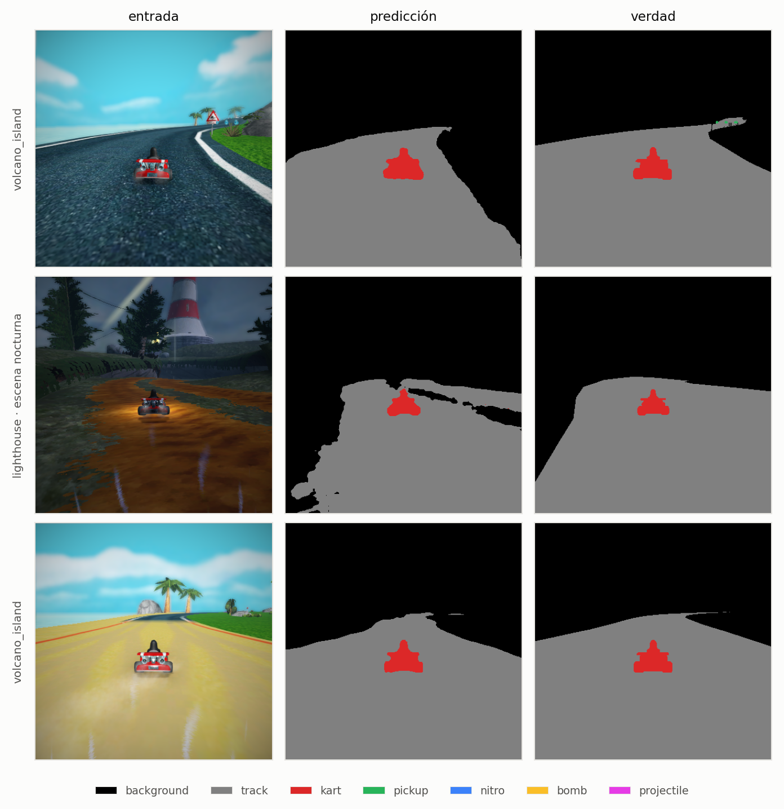
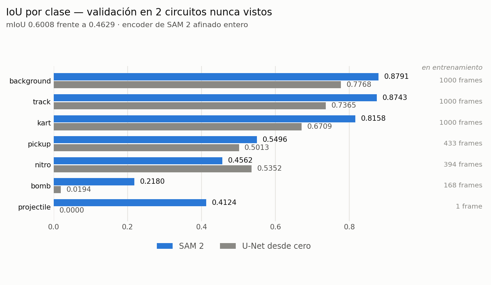
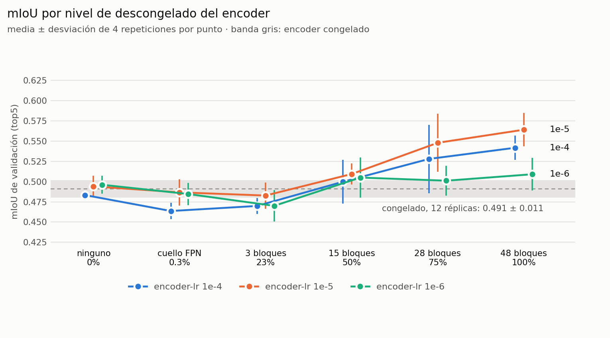
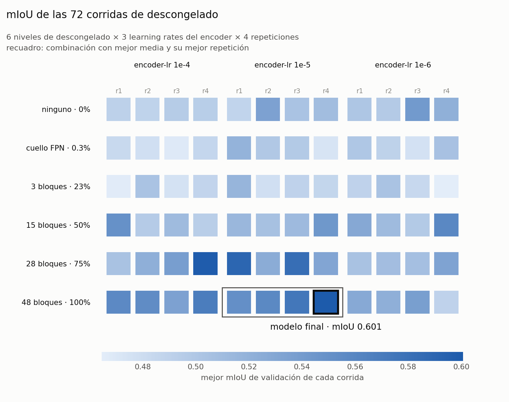
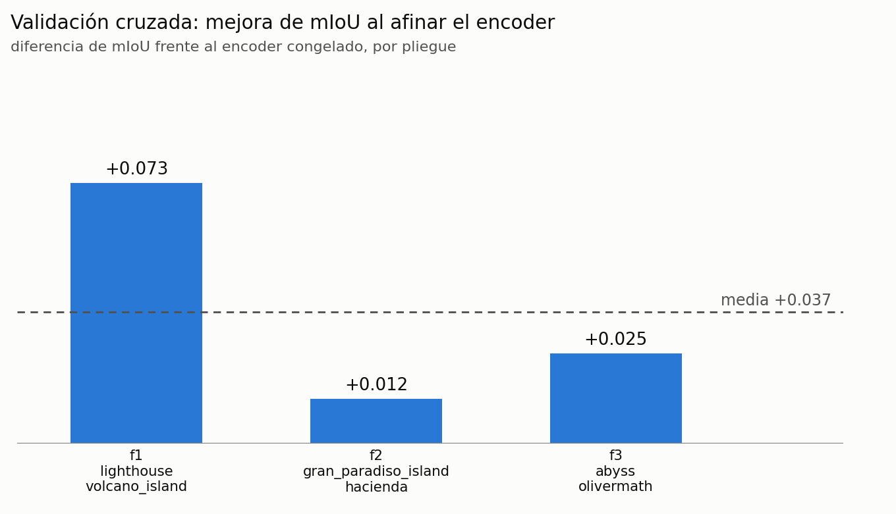
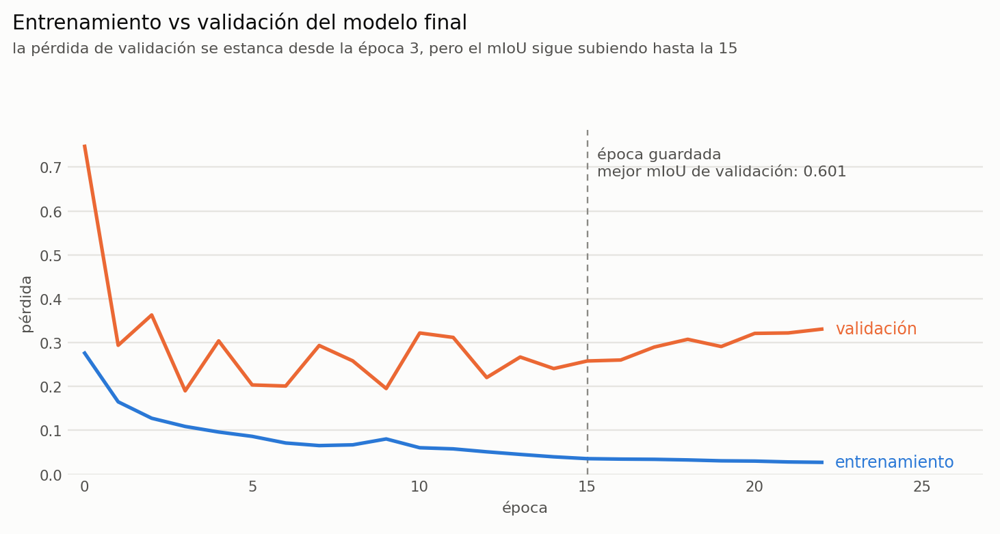
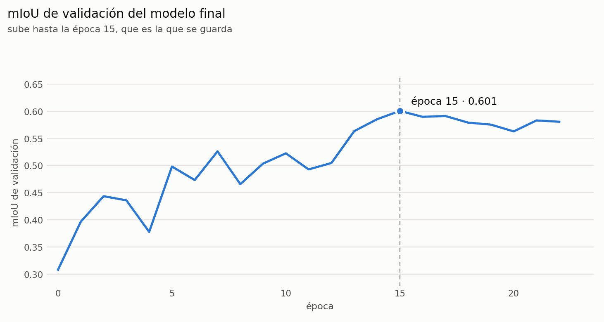

# Segmentación semántica de SuperTuxKart con SAM 2

Transfer learning desde **Segment Anything Model 2** para clasificar cada píxel de un
frame del videojuego en una de 7 clases: `background`, `track`, `kart`, `pickup`,
`nitro`, `bomb`, `projectile`.

**mIoU 0.6008** en dos circuitos que no se usaron para entrenar (mejor de 4 repeticiones;
media 0.571).

<picture>
  <source media="(prefers-color-scheme: dark)" srcset="docs/figuras/cualitativo-dark.png">
  
</picture>

---

## Probarlo

### Sin instalar nada — Colab

[](https://colab.research.google.com/github/ferjozsot23/sam2-transfer-learning/blob/main/demo.ipynb)

Abre el notebook, *Ejecutar todas*, y sube tus imágenes cuando lo pida. Descarga el modelo
la primera vez y devuelve las máscaras en un zip.

### En local

```bash
pip install -r requirements.txt
python predict.py ejemplos/
python predict.py mis_imagenes/ --out salida/ --masks
```

Cada imagen produce un panel `original | segmentación | superposición`. Con `--masks`
guarda además la máscara cruda de 1 canal con valores 0–6.

### Desde tu propio código

```python
from models import load_model

model = load_model('model.th')
pred  = model(x).argmax(1)
```

`x` es un tensor `(B,3,H,W)` en `[0,1]` y la salida `(B,H,W)` con el índice de clase de
cada píxel.

**`model.th` pesa 861 MB** y está en *Releases*; `predict.py` y el notebook lo descargan
solos. Incluye el encoder afinado completo, así que carga sin conexión.

---

## Método

SAM 2 **no es un segmentador semántico**. Es *promptable* y *binario*: recibe una imagen
más un prompt —un punto, una caja— y devuelve la máscara del objeto señalado. Lo que se
aprovecha es su **image encoder**, entrenado sobre millones de máscaras:

1. Se usa el encoder de SAM 2.1 Hiera-Large (212.7 M parámetros) con sus pesos
   preentrenados. Su salida `backbone_fpn` son 3 mapas de 256 canales a strides 4, 8 y 16.
2. Se descartan la *memory attention* (es para vídeo) y el *mask decoder* original (es binario).
3. Una **cabeza FPN nueva** (2.56 M parámetros) fusiona los tres niveles y produce 7 logits
   por píxel.
4. Se **afina el encoder entero** con un learning rate cien veces menor que el de la cabeza.

El `forward` normaliza, reescala a 448×448 y devuelve los logits al tamaño original de la
imagen, así que acepta cualquier resolución.

| entrenamiento | |
|---|---|
| pérdida | CrossEntropy ponderada por clase |
| optimizador | AdamW, weight decay 1e-4 |
| learning rate | cabeza 1e-3 · encoder 1e-5 |
| scheduler | ReduceLROnPlateau sobre el mIoU: ×0.5 tras 4 épocas sin mejorar |
| batch · épocas | 8 · hasta 30, parada temprana tras 8 sin mejorar |
| aumento de datos | volteo horizontal; brillo, contraste y saturación ×0.7–1.3 |
| selección | época con mejor mIoU de validación |

---

## Datos

1500 frames de 400×400 capturados en 6 circuitos del juego, 250 por circuito, cada uno con
su máscara de 7 clases. El split es **por circuito**: los frames de un mismo circuito son
casi idénticos, así que un split aleatorio pondría frames gemelos a ambos lados y daría un
mIoU alto y falso.

| | circuitos | frames |
|---|---|---|
| entrenamiento | `abyss`, `gran_paradiso_island`, `hacienda`, `olivermath` | 1000 |
| validación | `lighthouse`, `volcano_island` | 500 |

El desbalance de clases es extremo: `background` y `track` concentran el 97.4% de los píxeles
y `projectile` el 0.010%. Por eso la métrica es el IoU por clase y no la accuracy, y la pérdida
va ponderada:

| clase | % de píxeles | frames con la clase | peso en la pérdida |
|---|---|---|---|
| background | 53.56 | 1000 | 0.16 |
| track | 43.82 | 1000 | 0.17 |
| kart | 2.44 | 1000 | 0.40 |
| pickup | 0.12 | 433 | 0.97 |
| nitro | 0.026 | 394 | 1.56 |
| bomb | 0.019 | 168 | 1.71 |
| projectile | 0.010 | 1 | 2.04 |

*Conjunto de entrenamiento. Peso = (1 / frecuencia)^0.30, normalizado a media 1.*

---

## Resultados

<picture>
  <source media="(prefers-color-scheme: dark)" srcset="docs/figuras/iou-dark.png">
  
</picture>

Medido con una matriz de confusión acumulada sobre los 500 frames de validación. La
referencia es una U-Net entrenada desde cero con el mismo dataset y el mismo split:

| clase | U-Net | SAM 2 | |
|---|---|---|---|
| background | 0.7768 | **0.8791** | +0.102 |
| track | 0.7365 | **0.8743** | +0.138 |
| kart | 0.6709 | **0.8158** | +0.145 |
| pickup | 0.5013 | **0.5496** | +0.048 |
| bomb | 0.0194 | **0.2180** | +0.199 |
| projectile | 0.0000 | **0.4124** | +0.412 |
| nitro | **0.5352** | 0.4562 | −0.079 |
| **mIoU** | 0.4629 | **0.6008** | **+0.138** |

SAM 2 gana en 6 de las 7 clases, una mejora relativa del 29.8% en mIoU, con una accuracy
global de 0.9327.

---

## Experimentos

113 corridas, todas registradas en `experimentos/resultados/`. El `top5` de una corrida es
la media de sus 5 mejores épocas de validación, más estable que el pico.

| experimento | corridas | resultado |
|---|---|---|
| backbone × `dim` × `lr` × exponente de pesos | 24 | `large` +0.020 sobre `small`; `dim` 256 +0.020 sobre 128; `lr` y exponente, sin efecto |
| backbone × resolución × `dim` | 7 | 1024 px no mejora a 448 px; `dim` 512 empeora (−0.012) |
| descongelamiento del cuello FPN | 2 | el cuello por sí solo empeora (−0.017) |
| descongelado del encoder × `encoder-lr` × 4 repeticiones | 72 | el encoder entero con `encoder-lr` 1e-5 es la mejor combinación |
| validación cruzada por circuito | 8 | afinar el encoder mejora en los 3 pliegues, +0.037 de media |

En conjunto suman 2898 épocas, 368 750 retropropagaciones y 21.5 h de GPU NVIDIA H200. Entre
12 corridas idénticas el `top5` varía con σ 0.011, así que se comparan medias y no corridas
sueltas.

### Cuánto descongelar el encoder

<picture>
  <source media="(prefers-color-scheme: dark)" srcset="docs/figuras/descongelado-encoder-dark.png">
  
</picture>

Descongelar solo el cuello o los últimos bloques empeora; descongelar el encoder entero con
`encoder-lr` 1e-5 es lo mejor, con un `top5` medio de 0.564 frente a 0.491 del congelado.

<picture>
  <source media="(prefers-color-scheme: dark)" srcset="docs/figuras/seleccion-dark.png">
  
</picture>

Cada combinación se entrenó 4 veces con la misma configuración (r1–r4); entre ellas solo
cambian la inicialización de la cabeza, el orden de las imágenes y el aumento de datos. Se
eligió la combinación con mejor media y, dentro de ella, la mejor repetición: la r4, guardada
en su época 15, es el modelo final.

### Validación cruzada

Cada par de circuitos pasa una vez a validación, y en cada caso se compara el encoder
congelado con el afinado entero.

<picture>
  <source media="(prefers-color-scheme: dark)" srcset="docs/figuras/validacion-cruzada-dark.png">
  
</picture>

| pliegue | circuitos de validación | congelado | afinado | mejora |
|---|---|---|---|---|
| f1 | `lighthouse`, `volcano_island` | 0.491 | 0.564 | +0.073 |
| f2 | `gran_paradiso_island`, `hacienda` | 0.584 | 0.596 | +0.012 |
| f3 | `abyss`, `olivermath` | 0.462 | 0.487 | +0.025 |
| **media** | | | | **+0.037** |

La configuración se eligió con f1, por eso su mejora es la más alta; la media de los tres
pliegues, **+0.037**, es la estimación realista.

### Entrenamiento vs validación

<picture>
  <source media="(prefers-color-scheme: dark)" srcset="docs/figuras/entrenamiento-validacion-dark.png">
  
</picture>

La pérdida de entrenamiento sigue bajando y la de validación se estanca desde la época 3: en
la época guardada, la de validación es 7.3 veces la de entrenamiento.

<picture>
  <source media="(prefers-color-scheme: dark)" srcset="docs/figuras/miou-validacion-dark.png">
  
</picture>

El mIoU de validación, en cambio, sigue subiendo hasta la época 15, que es la que se guarda:
el modelo se vuelve más confiado en los píxeles que falla, que es lo que la CrossEntropy
penaliza, pero acierta más píxeles.

---

## Limitaciones

- **`projectile` aparece en 2 frames de los 1500**, uno en entrenamiento y uno en
  validación. Su IoU de 0.41 se mide sobre ese único frame y es ruido.
- **`bomb` es la clase más baja** (0.218): el 48.7% de sus píxeles se predice como `pickup`.
- **213 M de parámetros afinados con 1000 imágenes.** La pérdida de validación se estanca
  pronto y la mejora frente al encoder congelado va de +0.012 a +0.073 según los circuitos.
- **No hay conjunto de test independiente.** Todas las cifras son de validación; la
  validación cruzada lo mitiga pero no lo sustituye.

---

## Reproducir

```bash
pip install -r requirements.txt
python train.py --data-root data --backbone large --size 448 --dim 256 \
    --lr 1e-3 --weight-power 0.30 --unfreeze-blocks 48 --unfreeze-neck \
    --encoder-lr 1e-5 --epochs 30 --early-stop 8 --batch-size 8
```

`data/` debe contener `images/` y `masks/`, emparejados por circuito e identificador.

### Estructura

- `models.py` — encoder de SAM 2 y cabeza FPN; `save_model` y `load_model`.
- `utils.py` — dataset, métricas y pesos de clase.
- `train.py` — entrenamiento.
- `predict.py` — inferencia sobre una imagen o una carpeta.
- `train.ipynb` — entrenamiento, métricas e imágenes segmentadas.
- `demo.ipynb` — demo en Colab.
- `experimentos/` — barrido multi-GPU y resultados de las 113 corridas.
- `servidor/` — scripts para entrenar en un servidor GPU remoto con Docker.

Entrenado en GPUs NVIDIA H200 con Docker (torch 2.13, CUDA). Probado en macOS con torch 2.14
sobre CPU. Depende de `torch`, `torchvision`, `numpy`, `Pillow` y `sam2`.

---

## Referencias

- N. Ravi et al., *SAM 2: Segment Anything in Images and Videos*, arXiv:2408.00714, 2024.
  El código y los pesos de SAM 2 se distribuyen bajo licencia Apache 2.0.
